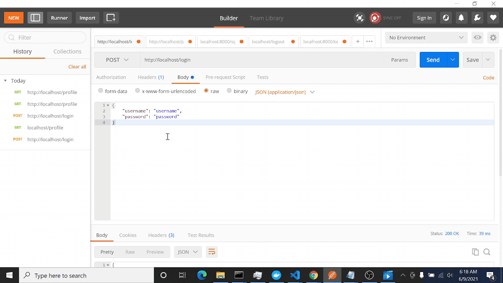
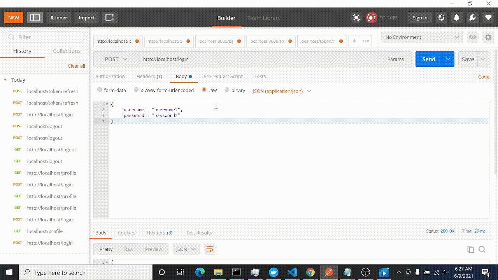
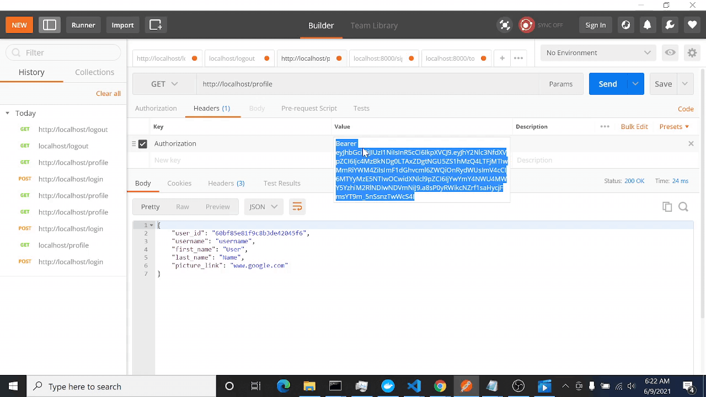

# JWT LOGIN

This is my implementation of auth with jwt (JSON Web Token). JWT is a way to authenticate your credentials securely without exposing your information. To put it simply, after the user logs in successfully, the server gives 2 tokens, an access token and a refresh token. Access token can be used by the user to identify themself and give access to things in the server, hence the name "Access". Refresh token is a token to generate another pair in case the access token expires. That's because typically an access token has shorter lifespan compared to refresh token.

<figure>
    
    <figcaption align = "center">Generate Token and Get</figcaption>
</figure>

<figure>
    
    <figcaption align = "center">Refresh your token</figcaption>
</figure>

<figure>
    
    <figcaption align = "center">Log out</figcaption>
</figure>

This implementation uses redis to save the tokens and mongodb as the database. There are two services that are independent of each other, login and profile. They are combined together using docker compose and traefik as the reverse proxy.

To run it, type `docker-compose build && docker-compose up -d reverse-proxy`. The exposed ports are: 
- /login POST `{ username, password } -> { acc_token, ref_token }`
- /signup POST `{ username, password } -> { successful / error}`
- /logout POST (require access token)
- /refresh/token POST `{ refresh_token } -> { refresh_token, access_token }`
- /profile GET (require access token) `{} -> { userid, username, first_name, last_name, pict_link }`
- /profile POST (require access token) `{ username, first_name, last_name, pict_link } => { successful / error }`

Note: Do not open from the root of the project, because the error check is a little bit messed up

TODO: 
- [ ] frontend
- [ ] cleaner code
- [ ] more performant code